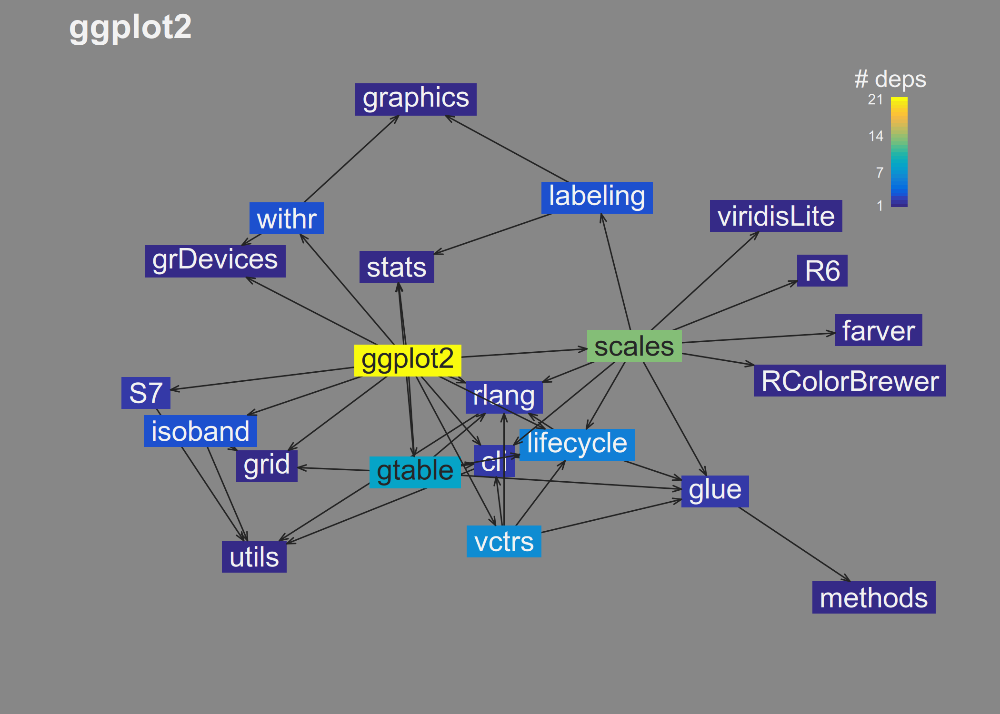

<!-- README.md is generated from README.Rmd. Please edit that file -->

# havel

<!-- badges: start -->

<!-- badges: end -->

The goal of havel is to vizualize and tabulate dependencies in R
packages. This will help R package developers identify dependencies that
contribute more to the dependency load and/or are easier to remove.

## Installation

You can install the development version of havel from
[GitHub](https://github.com/) with:

``` r
# install.packages("pak")
pak::pak("andrewGhazi/havel")
```

## Example

`havel` has two main functions: `plot_deps_graph()` and
`uniq_pkg_deps()`.

### `plot_deps_graph()`

Use `plot_deps_graph()` to look up and plot the dependency graph of a
package:

``` r
library(havel)

plot_deps_graph("ggplot2")
```



You can see that:

- `ggplot2` has 21 dependencies in total (direct and indirect).
- On the right, the `scales` package contributes several dependencies
  that nothing else depends on. If the `ggplot2` developers were looking
  to lighten their package (not that they should), eliminating the
  dependency on `scales` might be a good place to start looking.

Another example: What if I wanted to remove `Rcpp` as a dependency of
`havel` itself?

``` r
plot_deps_graph("andrewGhazi/havel") # looks it up on GitHub
```


Well, looks like that would be difficult. Even if I removed the direct
dependency, there would still be an indirect dependency on `Rcpp`
through `collapse` and `cppRouting`. I would need to remove all three to
avoid dependence on `Rcpp`.

### `uniq_pkg_deps()`

`uniq_pkg_deps()` tabulates what’s visually apparent on the plot:

``` r
uniq_pkg_deps("ggplot2")
#>            p1 n_uniq                                   uniq_pkgs
#>        <char>  <num>                                      <list>
#>  1:    scales      6 RColorBrewer,viridisLite,labeling,R6,farver
#>  2:       cli      1                                            
#>  3: grDevices      1                                            
#>  4:      grid      1                                            
#>  5:    gtable      1                                            
#>  6:   isoband      1                                            
#>  7: lifecycle      1                                            
#>  8:     rlang      1                                            
#>  9:        S7      1                                            
#> 10:     stats      1                                            
#> 11:     vctrs      1                                            
#> 12:     withr      1
```

`scales` introduces six unique dependencies to `ggplot2`, including
itself.

Sometimes there’s no single package that introduces many unique
dependencies, but there may be a *pair* or *triplet* that does. You can
check the impact of removing each combination of `order = 2` packages
like so:

``` r
uniq_pkg_deps("ggplot2", order = 2) |> 
  head()
#>           p1     p2 n_uniq                                            uniq_pkgs
#>       <char> <char>  <num>                                               <list>
#> 1:    scales  withr      8 RColorBrewer,graphics,viridisLite,labeling,R6,farver
#> 2:       cli scales      7          RColorBrewer,viridisLite,labeling,R6,farver
#> 3: grDevices scales      7          RColorBrewer,viridisLite,labeling,R6,farver
#> 4:      grid scales      7          RColorBrewer,viridisLite,labeling,R6,farver
#> 5:    gtable scales      7          RColorBrewer,viridisLite,labeling,R6,farver
#> 6:   isoband scales      7          RColorBrewer,viridisLite,labeling,R6,farver
```

`scales` + `withr` introduce eight.

## Related/prior work

There are other packages / posts out there on this type of thing:

- [`miniCRAN`](https://github.com/andrie/miniCRAN) has a [vignette on
  similar plotting
  functionality](https://cran.r-project.org/web/packages/miniCRAN/vignettes/miniCRAN-dependency-graph.html).
- [`pkgnet`](https://uptake.github.io/pkgnet/index.html) offers an
  expansive dependency analysis suite.
- [`depgraph`](https://github.com/crsh/depgraph) is pretty similar but
  uses different aesthetic mappings.
- [`DependenciesGraphs`](https://datastorm-open.github.io/DependenciesGraphs/)
  and
  [`pkgdepR`](https://cran.r-project.org/web/packages/pkgdepR/index.html)
  visualize the dependencies of *functions* used within a package.
- [`pkgndep`](https://cran.r-project.org/web/packages/pkgndep/index.html)
  visualizes similar information in a heatmap format, as well as
  provides different “heaviness” metrics.

`havel` offers some unique advantages nonetheless:

- It uses `pak::pkg_deps()` to look up the dependency connections
  instead of `tools::package_dependencies()`. This enables more
  versatile lookups of packages on Bioc, GitHub, etc.
- `havel` itself is fairly light and fast, depending only on pak, some
  fastverse packages, and base R graphics…
  - …but it includes a ggplot version too in the Suggests if you prefer
    that. Set `gg = TRUE`.
- The default plotting parameters are carefully hand-crafted to look
  nice 😊

## FAQ

> Why’d you make this?

- I was annoyed by packages with hundreds of dependencies and wanted to
  be able to quickly generate passive-aggressive plots visualizing their
  bloat.
- I wanted to learn about graph algorithms and R’s low-level graphics
  packages.

> What’s with the name?

Havel’s Ring is an item in Dark Souls that helps you deal with excessive
burdens. (Plus, every permutation of “pkg”/“dep”/“graph” was taken.)

## TODO

- more tests
  - properly handle cases with 0/1 deps, local packages, etc
- color edges by dependency type
- ~~copy over ggplot version~~ ✓
- highlight direct dependencies
- ~~uniq_pkg_deps() function~~ ✓
- eliminate my precious pipes so I don’t require R \>= 4.1
- Fix missing arrows between base packages (e.g. currently there are
  arrows missing from `methods` → `utils`,`stats`)
