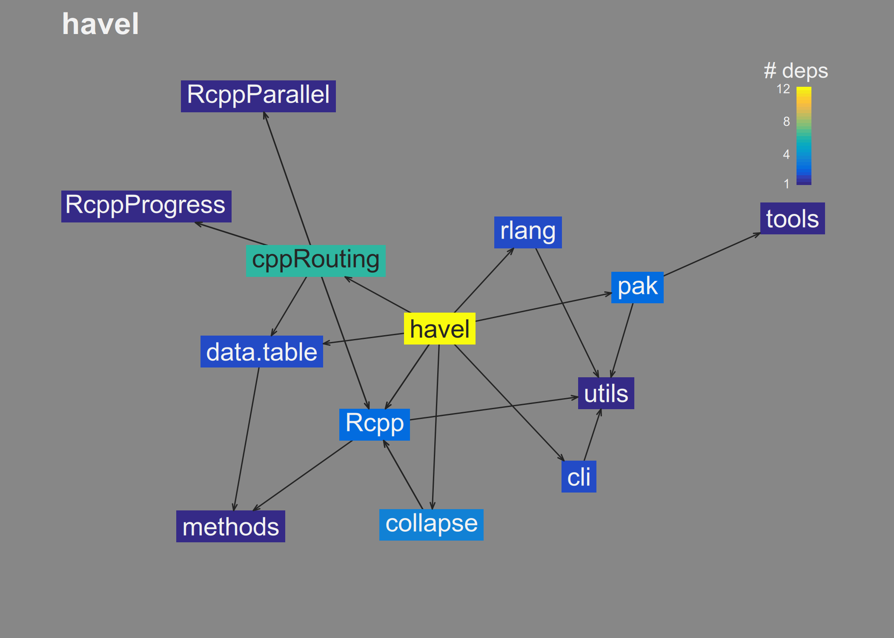

<!-- README.md is generated from README.Rmd. Please edit that file -->

# havel

<!-- badges: start -->

<!-- badges: end -->

The goal of havel is to vizualize and tabulate dependencies in R
packages. This will help R package developers identify dependencies that
contribute more to the dependency load and/or are easier to remove.

## Installation

You can install the development version of havel from
[GitHub](https://github.com/) with:

``` r
# install.packages("pak")
pak::pak("andrewGhazi/havel")
```

## Example

Use `plot_deps_graph()` to look up and plot the dependency graph of a
package:

``` r
library(havel)

plot_deps_graph("ggplot2")
```


You can see that:

- `ggplot2` has 31 dependencies in total (direct and indirect).
- On the left side that the `scales` package contributes several
  dependencies that nothing else depends on. If the `ggplot2` developers
  were looking to lighten their package (not that they should),
  eliminating the dependency on `scales` might be a good place to start
  looking.

Another example: What if I really wanted to remove `Rcpp` as a
dependency of `havel` itself?

``` r
plot_deps_graph("andrewGhazi/havel")
```



Well, looks like that would be difficult. Even if I remove the direct
dependency, there would still be an indirect dependency on `Rcpp`
through `collapse` and `cppRouting`.

\< bit about `uniq_pkg_deps()` \>

## Related/prior work

There are other packages / posts out there on this type of thing:

- [`miniCRAN`](https://github.com/andrie/miniCRAN) has a [vignette on
  similar plotting
  functionality](https://cran.r-project.org/web/packages/miniCRAN/vignettes/miniCRAN-dependency-graph.html).
- [`pkgnet`](https://uptake.github.io/pkgnet/index.html) offers an
  expansive dependency analysis suite.
- [`depgraph`](https://github.com/crsh/depgraph) is pretty similar but
  uses different aesthetic mappings.
- [`DependenciesGraphs`](https://datastorm-open.github.io/DependenciesGraphs/)
  and
  [`pkgdepR`](https://cran.r-project.org/web/packages/pkgdepR/index.html)
  visualize the dependencies of *functions* used within a package.
- [`pkgndep`](https://cran.r-project.org/web/packages/pkgndep/index.html)
  visualizes similar information in a heatmap format, as well as
  provides different “heaviness” metrics.

`havel` offers some unique advantages nonetheless:

- It uses `pak::pkg_deps()` to look up the dependency connections
  instead of `tools::package_dependencies()`. This enables more
  versatile lookups of packages on Bioc, GitHub, etc.
- `havel` itself is fairly light and fast, depending only on pak, some
  fastverse packages, and base R graphics…
  - …but it includes a ggplot version in the Suggests if you prefer
    that. Set `gg = TRUE`.
- The default plotting parameters are carefully hand-crafted to look
  nice 😊

## Misc

> Why’d you make this?

- I wanted to learn about graph algorithms and R’s low-level graphics
  packages.
- I was annoyed by packages with hundreds of dependencies.

> What’s with the name?

Havel’s Ring is an item in Dark Souls that helps you deal with excessive
burdens.

## TODO

- more tests
  - properly handle cases with 0/1 deps, local packages, etc
- color edges by dependency type
- copy over ggplot version
- highlight direct dependencies
- uniq_pkg_deps() function
